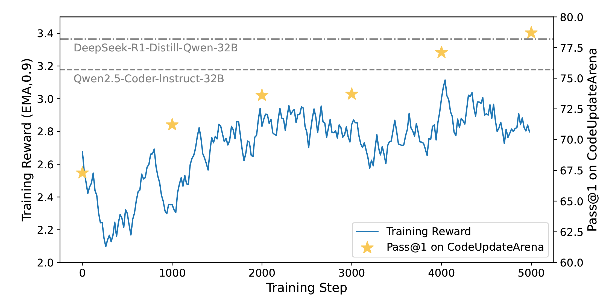

# ReCode: Updating Code API Knowledge with Reinforcement Learning

The official code implementation of the paper "ReCode: Updating Code API Knowledge with Reinforcement Learning".



## Environment Installation

We recommend using conda to deploy the environment:

```bash
conda create -n rec python==3.10
conda activate rec
git clone https://github.com/zjunlp/ReCode.git
cd ReCode
```

Our project relies both on trl and verl, so it needs to be installed:

```bash
cd src/DAPO/
git clone https://github.com/volcengine/verl.git
USE_MEGATRON=0 bash scripts/install_vllm_sglang_mcore.sh
pip3 install --no-deps -e .
pip3 install trl
```

## Data Preparation

We have uploaded our collected data to Hugging Face, you can download it [here](). Each piece of data contains the following six fields:

- **Dependency** specifies the library;
- **New_version** indicates the required version of the library;
- **Description** provides an explanation of the code's functionality;
- **Update_info** notes the details of the updates 
- **Old_code** contains the original code snippets
- **New_code** contains the updated code snippets

The following illustrates an example:

```json
{
    "dependency": "Numpy", 
    "new_version": "==2.2.0", 
    "description": "The code demonstrates how to assign a custom docstring to a NumPy ufunc to enhance its documentation and improve code readability.", 
    "update_info": "_add_newdoc_ufunc is now deprecated. ufunc.__doc__ = newdoc should be used instead.", 
    "old_code": "import numpy as np\n\nmy_ufunc = np.frompyfunc(lambda x: x**2, 1, 1)\n\nnp._add_newdoc_ufunc(my_ufunc, \"This is a custom ufunc that squares the input.\")", 
    "new_code": "import numpy as np\n\nmy_ufunc = np.frompyfunc(lambda x: x**2, 1, 1)\n\nmy_ufunc.__doc__ = \"This is a custom ufunc that squares the input.\""
}
```

## Run

### GRPO Training

For GRPO training, we provide the script located at `scripts/grpo.sh`. Before using it, simply fill in the necessary content within the script.

```bash
bash scripts/grpo.sh
```

### DAPO Training

Due to the requirements of the verl library for data format, it is necessary to preprocess the data before training.

```bash
python3 src/DAPO/data_process.py
```

After that, you can directly execute the script:

```bash
bash scripts/dapo.sh
```

## Acknowledgement

Our code is build on [trl](https://github.com/huggingface/trl) and [verl](https://github.com/volcengine/verl). Thanks to their great works.
