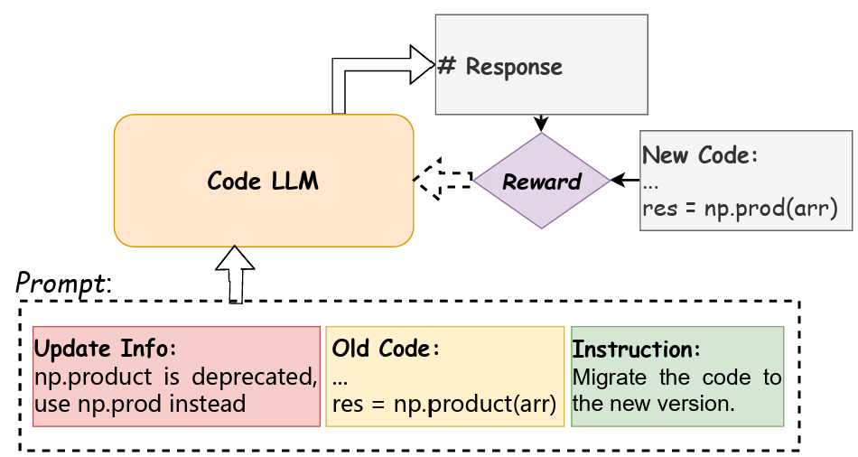

<div align="center">
<h1 align="center">ReCode</h1>
<h3 align="center">Updating Code API Knowledge with Reinforcement Learning</h3>

<p align="center">
  <a href="https://www.arxiv.org/abs/2506.20495">📄arXiv</a> •
  <a href="https://huggingface.co/collections/zjunlp/recode-68634da23d3b7bcc416c1007">🤗HuggingFace</a> •
  <a href="https://huggingface.co/datasets/zjunlp/ReCode-Train-Data">📖Datasets</a>
</p>

[](https://github.com/zjunlp/ReCode) [](https://opensource.org/licenses/MIT) 

</div>

## Table of Contents

- [🌟Overview](#overview)
- [🔧Installation](#installation)
- [📚Dataset Preparation](#dataset-preparation)
- [📉Training](#training)
- [🚩Citation](#citation)
- [🌻Acknowledgement](#acknowledgement)

## 🌟Overview

Large Language Models (LLMs) exhibit remarkable code generation capabilities but falter when adapting to frequent updates in external library APIs. This critical limitation, stemming from reliance on outdated API knowledge from their training data, even with access to current documentation, impedes reliable code generation in dynamic environments. To tackle this issue, we propose ReCode (rule-based **Re**inforcement learning for **Code** Update), a novel framework that mimics human programmer adaptation to API changes.

<div align="center">

</div>

## 🔧Installation

We recommend creating a new conda environment to run our project:

```bash
# create a conda environment
conda create -n recode python=3.10
conda activate recode

# clone our project
git clone https://github.com/zjunlp/ReCode.git
cd ReCode

# install dependencies
pip install -r requirements.txt
```

## 📚Dataset Preparation

We have uploaded our collected data to Hugging Face, you can download it [here](). Each piece of data contains the following six fields:

- **dependency** specifies the library;
- **new_version** indicates the required version of the library;
- **description** provides an explanation of the code's functionality;
- **update_info** notes the details of the updates 
- **old_code** contains the original code snippets
- **new_code** contains the updated code snippets

The following illustrates an example:

```json
{
    "dependency": "Numpy", 
    "new_version": "==2.2.0", 
    "description": "The code demonstrates how to assign a custom docstring to a NumPy ufunc to enhance its documentation and improve code readability.", 
    "update_info": "_add_newdoc_ufunc is now deprecated. ufunc.__doc__ = newdoc should be used instead.", 
    "old_code": "import numpy as np\n\nmy_ufunc = np.frompyfunc(lambda x: x**2, 1, 1)\n\nnp._add_newdoc_ufunc(my_ufunc, \"This is a custom ufunc that squares the input.\")", 
    "new_code": "import numpy as np\n\nmy_ufunc = np.frompyfunc(lambda x: x**2, 1, 1)\n\nmy_ufunc.__doc__ = \"This is a custom ufunc that squares the input.\""
}
```

## 📉Training

### GRPO Training

For GRPO training, we provide the script located at `scripts/grpo.sh`. Before using it, simply fill in the necessary content within the script.

```bash
bash scripts/grpo.sh
```

### DAPO Training

Due to the requirements of the verl library for data format, it is necessary to preprocess the data before training.

```bash
python3 src/DAPO/data_process.py
```

After that, you can directly execute the script:

```bash
bash scripts/dapo.sh
```


## 🚩Citation

If you find our work helpful, please cite our paper:

```bibtex
@misc{wu2025recodeupdatingcodeapi,
      title={ReCode: Updating Code API Knowledge with Reinforcement Learning}, 
      author={Haoze Wu and Yunzhi Yao and Wenhao Yu and Huajun Chen and Ningyu Zhang},
      year={2025},
      eprint={2506.20495},
      archivePrefix={arXiv},
      primaryClass={cs.CL},
      url={https://arxiv.org/abs/2506.20495}, 
}
```

## 🌻Acknowledgement

Our code is build on [trl](https://github.com/huggingface/trl) and [verl](https://github.com/volcengine/verl). Thanks to their great works!
